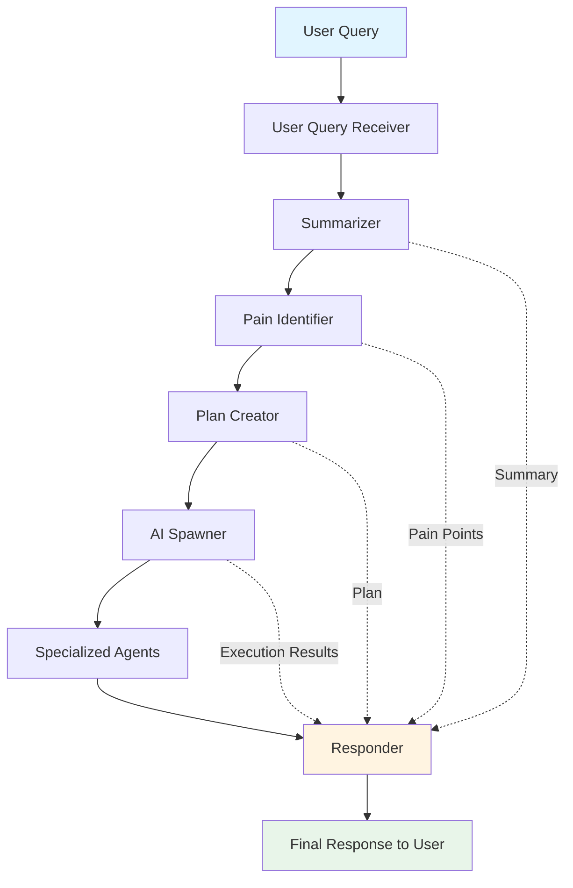

# Example Prompt Chaining

A TypeScript implementation demonstrating a sophisticated prompt chaining system with specialized AI agents.

## Architecture

This system implements a multi-agent architecture where each agent specializes in a specific task:

### Agent Flow



### Components

1. **User Query Receiver**: Entry point that receives user queries and coordinates the chain
2. **Summarizer**: Extracts key findings from the user query
3. **Pain Identifier**: Identifies top pain points from the summary
4. **Plan Creator**: Creates a step-by-step plan using available tools
5. **AI Spawner**: Dynamically spawns specialized agents based on the plan
6. **Responder**: Aggregates results and responds to the user

## Installation

```bash
npm install
```

## Configuration

Create a `.env` file:

```
OPENAI_API_KEY=your_api_key_here
```

## Usage

### Interactive Mode (Chat with the System)

Start the interactive terminal chat:

```bash
npm run dev
# or
npm start
```

This starts an interactive CLI where you can chat with the system. Available commands:
- `help` - Show available commands
- `clear` - Clear screen
- `reset` - Reset the system
- `history` - Show chain execution history
- `exit` - Exit the program

### Demo Mode (Watch Example Processing)

Run the built-in demonstration:

```bash
npm run demo
```

This processes example queries and shows the complete chain execution.

## Project Structure

```
src/
├── types/           # TypeScript interfaces and types
├── agents/          # Specialized agent implementations
├── tools/           # Available tools for agents
├── orchestrator/    # Chain orchestration logic
├── cli.ts           # Interactive CLI (npm start/dev)
└── index.ts         # Demo examples (npm run demo)
```

## How It Works

1. User submits a query
2. Query is summarized to extract key information
3. Pain points are identified from the summary
4. A plan is created based on available tools
5. Specialized agents are dynamically spawned to execute the plan
6. Results are aggregated and returned to the user
