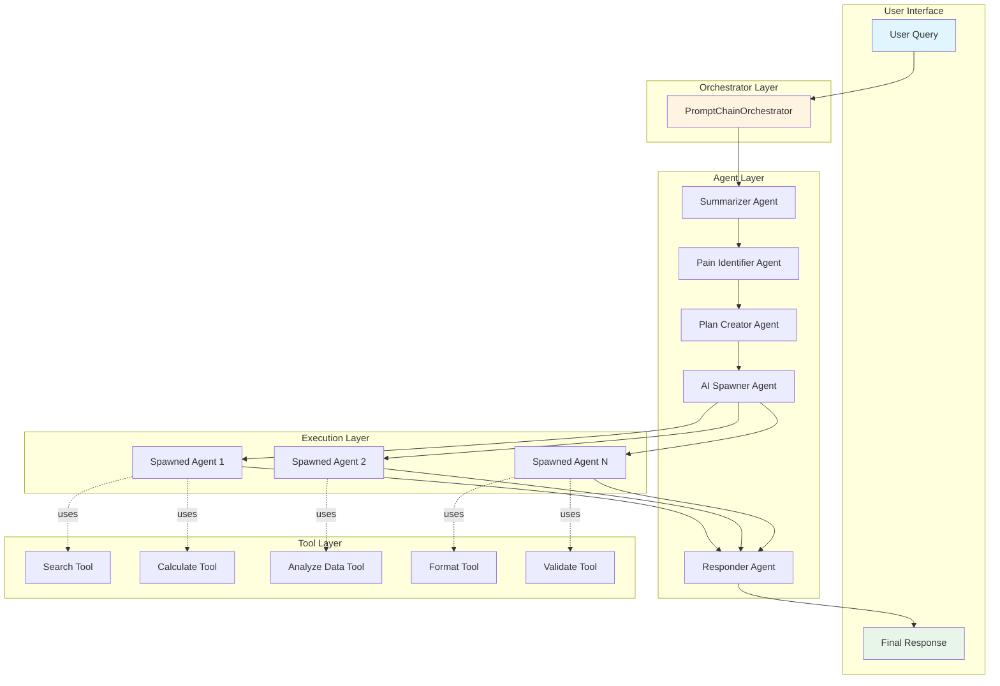
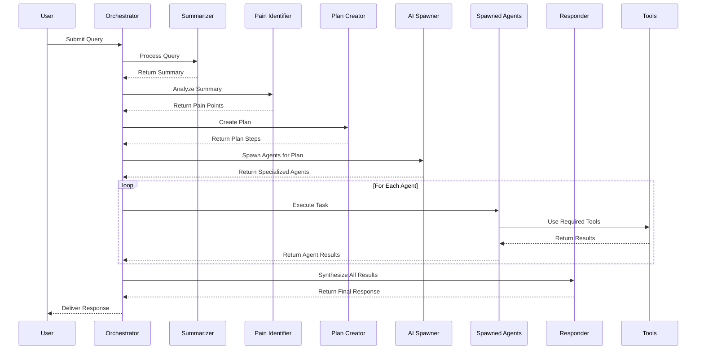

# Architecture Documentation

## Overview

The Example Prompt Chaining system implements a sophisticated multi-agent architecture where specialized AI agents collaborate to process user queries through a coordinated chain of operations.

## System Architecture



## Components

### 1. Base ChatCompletion Class

**File:** `src/agents/base.ts`

The foundation class that all specialized agents extend. Provides:
- OpenAI API integration
- Conversation history management
- Message execution
- Configuration handling

**Key Features:**
- Maintains conversation context
- Supports configurable temperature and max tokens
- Includes error handling
- Provides history reset capabilities

### 2. Specialized Agents

#### Summarizer Agent
**File:** `src/agents/summarizer.ts`

**Purpose:** Extract key findings from user queries

**System Prompt Strategy:**
- Focus on main topics and themes
- Identify specific requirements
- Extract important context
- Capture core objectives

**Configuration:**
- Temperature: 0.5 (more deterministic)
- Max Tokens: 500

#### Pain Identifier Agent
**File:** `src/agents/pain-identifier.ts`

**Purpose:** Identify user pain points from summaries

**System Prompt Strategy:**
- Look for frustrations and obstacles
- Identify inefficiencies
- Find missing features
- Detect technical blockers

**Output:** Numbered list of 3-5 pain points, ordered by severity

**Configuration:**
- Temperature: 0.6
- Max Tokens: 600

#### Plan Creator Agent
**File:** `src/agents/plan-creator.ts`

**Purpose:** Create actionable execution plans

**System Prompt Strategy:**
- Break down solutions into steps
- Identify tool requirements
- Estimate complexity levels
- Consider step dependencies

**Output:** JSON array of plan steps with:
- Step number
- Description
- Tools needed
- Complexity estimate (low/medium/high)

**Configuration:**
- Temperature: 0.7
- Max Tokens: 1500

### 3. AI Spawner

**File:** `src/agents/ai-spawner.ts`

**Purpose:** Dynamically create specialized agents based on plan steps

**Key Capabilities:**
- Creates unique agents for each plan step
- Assigns relevant tools to each agent
- Generates specialized system prompts
- Manages agent lifecycle

**Agent Creation Process:**
1. Receive plan step
2. Identify required tools
3. Generate specialized system prompt
4. Create agent with tool-calling capabilities
5. Return executable agent

**Tool Calling Format:**
```
TOOL: <tool_name>
PARAMS: <JSON parameters>
```

### 4. Responder Agent

**File:** `src/agents/responder.ts`

**Purpose:** Synthesize all results into a user-friendly response

**System Prompt Strategy:**
- Review all gathered information
- Synthesize into coherent narrative
- Provide actionable insights
- Address original query directly

**Input:**
- Original user query
- Summary
- Pain points
- Execution plan
- Agent results
- Chain steps

**Output:** Comprehensive, user-friendly response with:
- Query acknowledgment
- Key findings
- Recommendations
- Relevant caveats

**Configuration:**
- Temperature: 0.7
- Max Tokens: 2000

### 5. Prompt Chain Orchestrator

**File:** `src/orchestrator/prompt-chain.ts`

**Purpose:** Coordinate the entire multi-agent system

**Execution Flow:**
1. Initialize agent context
2. Summarize user query
3. Identify pain points
4. Create execution plan
5. Spawn specialized agents
6. Execute spawned agents
7. Generate final response

**Features:**
- Comprehensive logging
- Error handling at each step
- Context management
- Chain history tracking
- Reset capabilities

## Tool System

**File:** `src/tools/index.ts`

### Available Tools

1. **Search Tool**
   - Search for information
   - Returns simulated results with titles, snippets, URLs

2. **Calculate Tool**
   - Perform mathematical calculations
   - Evaluates expressions

3. **Analyze Data Tool**
   - Statistical analysis
   - Trend detection
   - Pattern recognition

4. **Format Tool**
   - Format data as JSON, Markdown, or plain text
   - Data transformation

5. **Validate Tool**
   - Validate data against criteria
   - Return validation results

### Tool Interface

```typescript
interface Tool {
  name: string;
  description: string;
  parameters: {
    type: string;
    properties: Record<string, any>;
    required?: string[];
  };
  execute: (args: any) => Promise<any>;
}
```

## Data Flow



## Context Management

The system maintains a shared context object throughout execution:

```typescript
interface AgentContext {
  userQuery: string;
  summary?: string;
  painPoints?: string[];
  plan?: string;
  toolResults?: Record<string, any>;
  intermediateResults: Record<string, any>;
}
```

This context is passed between agents and accumulates information as the chain progresses.

## Error Handling

- Each agent includes try-catch blocks
- Errors are logged with agent context
- Failed agents return error objects
- System continues processing if possible
- Final response includes error information if relevant

## Extensibility

### Adding New Agents

1. Extend `BaseChatCompletion`
2. Define specialized system prompt
3. Implement agent-specific methods
4. Add to orchestrator chain

### Adding New Tools

1. Implement `Tool` interface
2. Add to `toolRegistry`
3. Tools automatically available to spawned agents

### Modifying Chain Flow

The orchestrator can be extended to:
- Add new processing steps
- Implement parallel agent execution
- Add conditional branching
- Include feedback loops

## Performance Considerations

- Agents execute sequentially to maintain context
- Tool execution is asynchronous
- Conversation history grows with each agent
- Consider implementing history pruning for long chains
- API rate limits may affect execution time

## Security Considerations

- API keys stored in environment variables
- Tool execution sandboxed
- Input validation in tools
- No arbitrary code execution (except demo calculate tool)
- Conversation history kept private per instance
